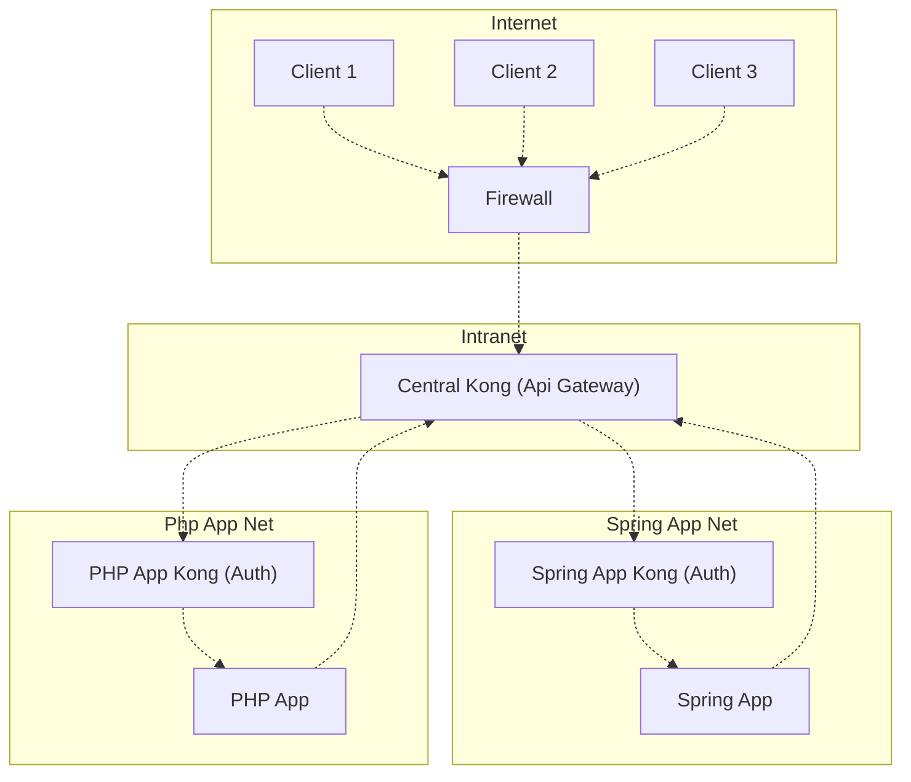
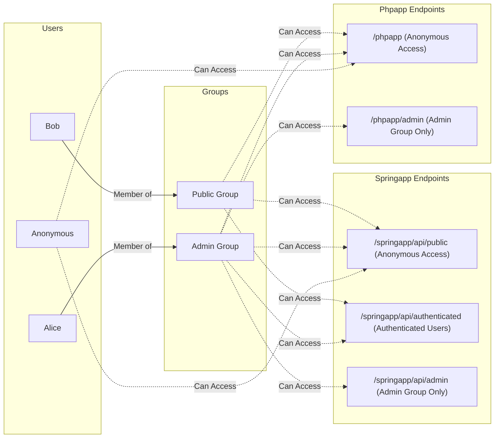

# POC-KONG

# Network schema



# Auth schema



## Clone the project
```bash
git clone https://github.com/FrankleyRocha/poc-kong.git
```

## Enter into `poc-kong/.container` folder
```bash
cd poc-kong/.container
```

## Startup the compose
```bash
docker compose up -d
```

## Testing

### anonymous access to phpapp
```bash
curl -i http://localhost:8000/phpapp
```

### anonymous does not have access to the phpgapp admin endpoint
```bash
curl -i http://localhost:8000/phpapp/admin
```

### Bob does not have access to the phpgapp admin endpoint
```bash
curl -i http://localhost:8000/phpapp/admin -H "apikey: bob-key"
```

### Alice can access the phpgapp admin endpoint
```bash
curl -i http://localhost:8000/phpapp/admin -H "apikey: alice-key"
```

### anonymous access to springapp public endpoint
```bash
curl -i http://localhost:8000/springapp/api/public
```

### anonymous does not have access to the springapp authenticated endpoint
```bash
curl -i http://localhost:8000/springapp/api/authenticated
```

### Bob can access the springapp authenticated endpoint
```bash
curl -i http://localhost:8000/springapp/api/authenticated -H "apikey: bob-key"
```

### Alice can access the springapp authenticated endpoint
```bash
curl -i http://localhost:8000/springapp/api/authenticated -H "apikey: alice-key"
```

### Bob does not have access to the springapp admin endpoint
```bash
curl -i http://localhost:8000/springapp/api/admin -H "apikey: bob-key"
```

### Alice can access the springapp admin endpoint
```bash
curl -i http://localhost:8000/springapp/api/admin -H "apikey: alice-key"
```

## Shutdown the compose
```bash
docker compose down
```
